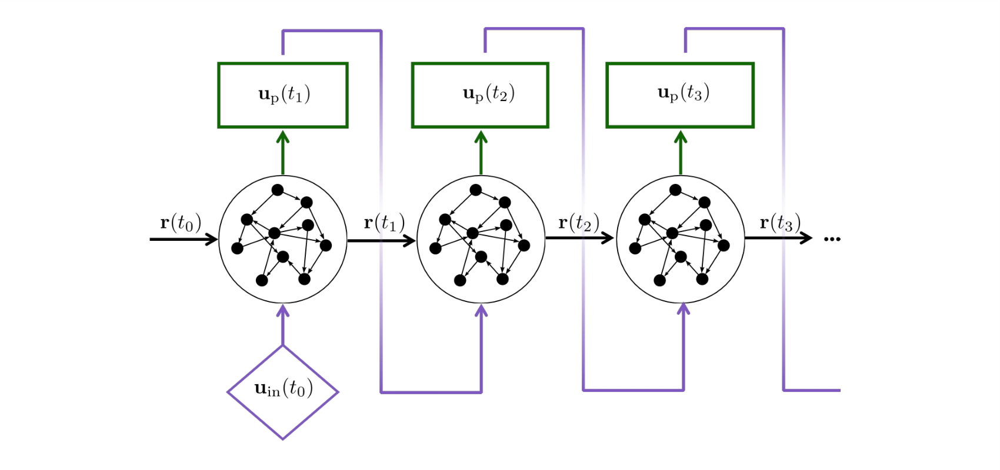

## Tutorials

### Echo State Networks

Echo State Networks (ESNs) are a type of recurrent neural network, whose training consists in solving a linear system and does not require gradient descent [1,2]. ESNs have been shown to perform with similar accuracy to other reccurrent neural networks, such as LSTMs and GRUs [3]. 

A tutorial with up to date self-containted implementation of echo state networks can be found [here](https://github.com/aracca994/Echo-State-Networks).

Training ESNs is straightforward, but their performance is highly sensitive to the selection of hyperparameters.
In the tutorial, we provide an easy to follow and computationally efficient implementation of hyperparameter selection through Bayesian Optimization [4].
For matrix multiplication, we use sparse implementation to improve computation efficiency and lower memory requirements.
We test the networks on the chaotic Lorenz system.  

### Computation of Lyapunov Spectrum and Kaplan-Yorke dimension

## References 

- [1] H. Jaeger, [Scholarpedia](http://www.scholarpedia.org/w/index.php?title=Echo_state_network).

- [2] M. Lukoševičius, A Practical Guide to Applying Echo State Networks, pp. 659–686 (2012). Springer Berlin Heidelberg. 

- [3] P.R. Vlachas et al., Backpropagation algorithms and Reservoir Computing in Recurrent Neural Networks for the forecasting of complex spatiotemporal dynamics, Neural Networks (2020).

- [4] A. Racca & L. Magri, 2021 Robust Optimization and Validation of Echo State Networks for learning chaotic dynamics, Neural Networks (2021).
